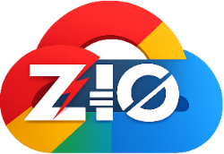

[//]: # (This file was autogenerated using `zio-sbt-website` plugin via `sbt generateReadme` command.)
[//]: # (So please do not edit it manually. Instead, change "docs/index.md" file or sbt setting keys)
[//]: # (e.g. "readmeDocumentation" and "readmeSupport".)

# Google Cloud clients for ZIO

Collection of Google Cloud clients generated by [Google REST API code generator](https://github.com/rolang/google-rest-api-codegen) including authentication.
based on [ZIO](https://zio.dev), [Sttp (v4)](https://sttp.softwaremill.com/en/latest/) and [Jsoniter](https://github.com/plokhotnyuk/jsoniter-scala).  

Released for Scala 3 with cross-platform support.  
Supported platforms: 
 - ✅ JVM 
   - tested java versions: 21
 - ✅ Native with LLVM (via [scala-native](https://scala-native.org/))
   - backed by [libcurl](https://curl.se/libcurl)
 - ❌ JavaScript (via [scala-js](https://www.scala-js.org), could be potentially added)

### Consult the [Documentation](https://anymindgroup.github.io/zio-gcp/) to learn how to use.